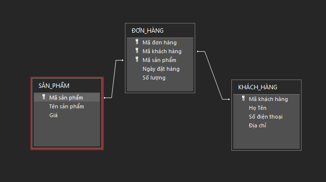

# Table of Contents

1. [Bài 1](#bài-1)
2. [Bài 2](#bài-2)
3. [Bài 3](#bài-3)
4. [Bài 4](#bài-4)

### PK: Primary Key : Khóa chính
### FK: Foreign Key: Khóa ngoài (Ngoại)


# Bài 1
### Trong CSDL quản lí một thư viện, trong các trường của bảng người đọc, nên chọn truonfg nào làm khóa chính ? Giải thích ?
(Tham khảo): 

- Trong bảng Người đọc của cơ sở dữ liệu quản lý thư viện, trường thích hợp nhất để làm khóa chính là Mã bạn đọc (ID bạn đọc, Số thẻ bạn đọc, v.v.).

Giải thích:
- Tính duy nhất: Mỗi bạn đọc cần có một mã số riêng biệt để phân biệt với những người khác. Nếu chọn các trường khác như tên hoặc địa chỉ, có thể xảy ra trùng lặp.
- Ổn định, không thay đổi: Mã bạn đọc thường cố định trong suốt quá trình sử dụng thư viện, trong khi các thông tin khác (tên, địa chỉ, số điện thoại) có thể thay đổi.
- Tính ngắn gọn, tối ưu truy vấn: Một mã số ngắn gọn giúp tăng tốc độ tìm kiếm và quản lý dữ liệu hiệu quả hơn so với sử dụng các trường dạng văn bản dài như tên hoặc email.
- Dễ dàng liên kết với các bảng khác: Trong mô hình quan hệ, bảng Người đọc sẽ có quan hệ với các bảng khác như Mượn trả sách. Nếu dùng mã bạn đọc làm khóa chính, việc truy vấn và quản lý dữ liệu sẽ dễ dàng hơn.

# Bài 2
### Sau khi tạo xong cấu trúc cho bảng trên, em dự kiến hai bảng nào có liên kết với nhau bằng khóa ngoài, ta nên khai báo liên kết trước hay nên nhập dữ liệu cho 2 bảng trước ?
(Tham khảo): 

VD mình có 3 bảng được tạo như thế này: 


### **Bảng Người đọc (NGƯỜI_ĐỌC)**
| Mã bạn đọc (PK) | Họ và tên      | Ngày sinh  | Số điện thoại  | Địa chỉ |
|----------------|--------------|------------|--------------|--------|
| 1001          | Nguyễn Văn A | 01/01/2000 | 0987654321   | Hà Nội |
| 1002          | Trần Thị B    | 15/05/1998 | 0912345678   | TP.HCM |

### **Bảng Sách (SÁCH)**
| Mã sách (PK) | Tên sách              | Tác giả         | Năm xuất bản | Số lượng |
|--------------|----------------|--------------|-------------|---------|
| B001         | Lập trình C++  | Nguyễn Văn C | 2020        | 5       |
| B002         | Toán cao cấp   | Trần Văn D   | 2019        | 3       |

### **Bảng Mượn trả sách (MƯỢN_TRẢ)**
| Mã bạn đọc (PK, FK) | Mã sách (PK, FK) | Ngày mượn  | Ngày trả dự kiến | Ngày trả thực tế |
|---------------------|-----------------|------------|------------------|------------------|
| 1001               | B001            | 01/03/2025 | 10/03/2025       | NULL             |
| 1002               | B002            | 02/03/2025 | 12/03/2025       | NULL             |


Ta sẽ liên kết các bảng với nhau bằng khóa ngoài theo liên kết: 
- [Người đọc] - [Mượn trả sách] theo khóa "Mã bạn đọc". 
- [Sách] - [Mượn trả sách] theo khóa "Mã sách".


#### Nên khai báo liên kết trước để đảm bảo tính toàn vẹn dữ liệu, tránh trường hợp nhập dữ liệu không hợp lệ (ví dụ: mượn sách của một người không tồn tại).

# Bài 3
| Tiêu chí               | Khóa chính (PK)                                | Khóa ngoài (FK)                                      |
|------------------------|------------------------------------------------|------------------------------------------------------|
| Chức năng              | Xác định duy nhất từng bản ghi trong bảng      | Liên kết bảng với bảng khác  (là một trường hoặc một số trường của bảng này và cũng là khóa của một bảng khác)                       |
| Giá trị trùng          | Không thể trùng lặp                            | Có thể trùng lặp                                     |
| Giá trị NULL*           | Không được NULL                                | Có thể NULL (tùy ràng buộc)                           |
| Số lượng trong bảng    | Chỉ có một khóa chính                          | Có thể có nhiều khóa ngoài                           |
| Ví dụ                  | "Mã bạn đọc" trong bảng   [Người đọc]               | "Mã bạn đọc" của [Mượn trả sách] tham chiếu đến "Mã bạn đọc" của [Người đọc]|

***NULL: là một ô không chứa giá trị gì cả (trống)**

***Sử dụng bảng có ở bài 2.**


# Bài 4: 
Dưới đây là một bộ CSDL gồm 3 bảng theo mô hình quản lý khách hàng - đơn hàng - sản phẩm trong một cửa hàng.

***PK: Primary key: Khóa chính** \
***FK: Foreign key: Khóa ngoài (ngoại)**

### **Bảng KHÁCH_HÀNG (KHÁCH_HÀNG)**
| Mã khách hàng (PK)| Họ Tên                | Số điện thoại | Địa chỉ   |
|---------------|-----------------------|---------------|-----------|
| U-101         | Nguyễn Văn A          | 0987654321    | Đà Nẵng   |
| U-102         | Phan Thị B            | 0214643657    | Đà Nẵng     |
| U-103         | Trần Văn C            | 0945472024    | Hà Nội    |
| U-104         | Trịnh Trần Phương Tuấn| 0537987325    | Bến Tre   |


### **Bảng SẢN_PHẨM (SẢN_PHẨM)**
| Mã sản phẩm (PK) | Tên sản phẩm | Giá       |
|-------------|--------------|-----------|
| P-101       | Laptop       | 15000000  |
| P-102       | Điện thoại   | 29990000  |
| P-103       | Tai nghe     | 430000    |
| P-104       | Ốp lưng      | 15000     |
| P-105       | Dây sạc      | 125000    |

### **Bảng ĐƠN_HÀNG (ĐƠN_HÀNG)**
| Mã đơn hàng (PK) | Mã khách hàng (FK) | Mã sản phẩm (FK) | Ngày đặt hàng | Số lượng |
|-------------|---------------|-------------|----------------|----------|
| O-101       | U-101         | P-102       | 3/4/2025       | 1        |
| O-102       | U-101         | P-101       | 3/7/2025       | 2        |
| O-103       | U-104         | P-103       | 3/13/2025      | 5        |
| O-104       | U-102         | P-104       | 3/19/2025      | 10       |
| O-105       | U-103         | P-105       | 3/19/2025      | 1        |
| O-106       | U-103         | P-102       | 3/20/2025      | 1        |

**Bảng Relationships:**




## FAQ

**SELECT * là gì ?**\
"SELECT *" nghĩa là chọn tất cả các trường, ý chỉ là lấy toàn bộ thông tin.

**Bảng lấy tên ở đâu ?**\
Hãy nhớ, tên của bảng không kèm chữ "Bảng" (trừ khi họ yêu cầu hoặc tên in hoa).
VD: 
Bảng KHÁCH_HÀNG => Tên bảng là "KHÁCH_HÀNG" \
Bảng BẢNG_KHÁCH_HÀNG => Tên bảng là "BẢNG_KHÁCH_HÀNG"

**SELECT DISTINCT là gì ?**\
Được dùng để loại bỏ các giá trị trùng lặp trong kết quả truy vấn, chỉ trả về các giá trị khác nhau (duy nhất) trong một hoặc nhiều cột.

**Cấu trúc của một câu truy vấn trong một bảng:**\
`SELECT <Trường nào ? kèm "[]" bên ngoài mỗi trường> FROM <Bảng nào ?> WHERE <Biểu thức logic hay điều kiện>`

**Cấu trúc của một câu truy vấn cần liên kết giữa các bảng:**\
```
SELECT BẢNG_1.[Trường 1], BẢNG_2.[Trường 1], [Trường 3], ...
FROM BẢNG_1 INNER JOIN BẢNG_2 ON BẢNG_1.[Trường 1] ___ BẢNG_2.[Trường 1]
WHERE [Trường 3] ___ "ABCD"
```

**Với ___ là biểu thức LOGIC (=, >=, <=, >, <, <>) với <> nghĩa là khác.**

**VD: BẢNG_1.[Trường 1] = BẢNG_2.[Trường 1]** \
Nghĩa là lấy thông tin của dòng mà có Trường 1 của Bảng 1 trùng với Trường 1 của bảng 2. (Cùng tên trường vì đây là khóa ngoài)

**Với tên bảng và trường:**
- Có thể không cần sử dụng "[]" nếu tên bảng không có dấu cách.
- Bắt buộc sử dụng "[]" nếu tên bảng có dấu cách.

## Câu hỏi Ví Dụ: 

### Câu hỏi 4.1: Truy vấn lấy danh sách tất cả khách hàng ở Đà Nẵng.
Tham khảo: \
`SELECT * FROM [Khách hàng] WHERE [Địa chỉ] = "Đà Nẵng" ;`

### Câu hỏi 4.2: Truy vấn các mặt hàng có giá từ 15 triệu trở lên.
Tham khảo: \
`SELECT * FROM [SẢN PHẨM] WHERE [Giá] >= 15000000`

### Câu hỏi 4.3: Truy vấn đơn hàng có số lượng mua 2 món trở lên.
Tham khảo: \
`SELECT * FROM [ĐƠN HÀNG] WHERE [Số lượng] >= 2`

### Câu hỏi 4.4: Truy vấn toàn bộ đồ đã mua của người tên Nguyễn Văn A
Tham khảo: \
```
SELECT SẢN_PHẨM.[Tên sản phẩm], SẢN_PHẨM.[Giá], ĐƠN_HÀNG.[Số lượng], ĐƠN_HÀNG.[Ngày đặt hàng]
FROM ĐƠN_HÀNG
INNER JOIN KHÁCH_HÀNG ON ĐƠN_HÀNG.[Mã khách hàng] = KHÁCH_HÀNG.[Mã khách hàng]
INNER JOIN SẢN_PHẨM ON ĐƠN_HÀNG.[Mã sản phẩm] = SẢN_PHẨM.[Mã sản phẩm]
WHERE KHÁCH_HÀNG.[Họ Tên] = "Nguyễn Văn A";
```

### Cẩu hỏi 4.5: Truy vấn danh sách sản phẩm đã được đặt hàng: 
Tham khảo: \
`SELECT DISTINCT [Mã sản phẩm] FROM ĐƠN_HÀNG;`

**Kết quả mong muốn: **
|Mã sản phẩm|
|-----------|
|P-102|
|P-101|
|P-103|
|P-104|

*Dù có 2 đơn đặt hàng có ID là "P-102" nhưng chỉ có 1 giá trị được lấy ra.