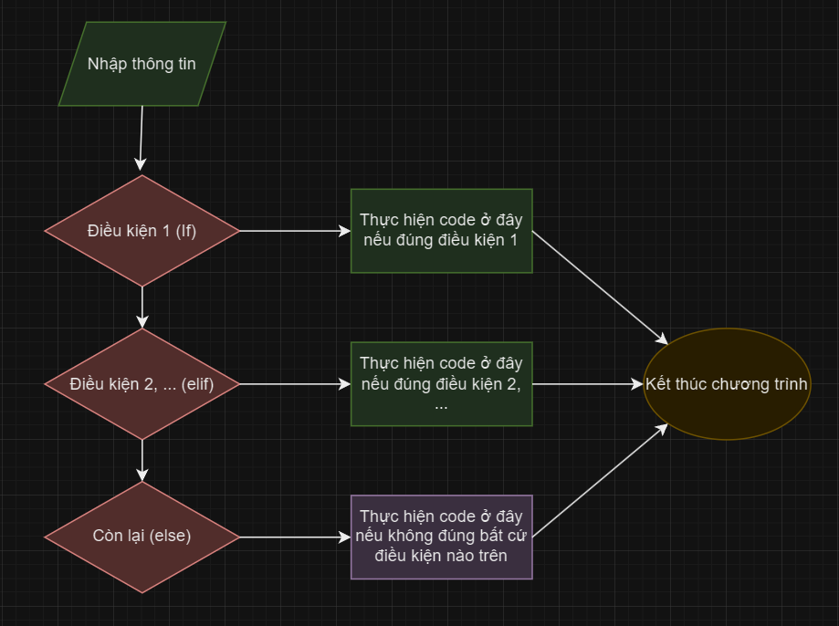
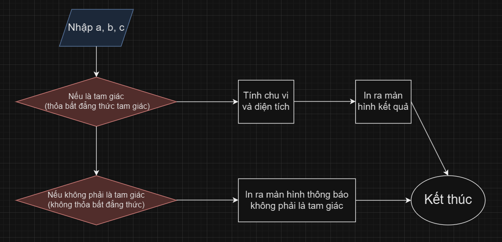
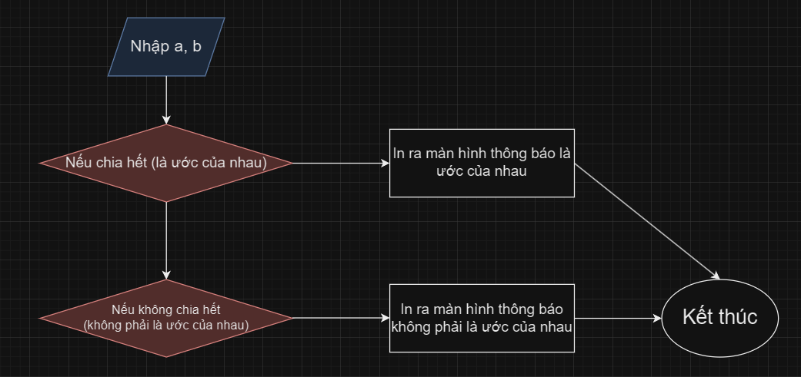

# Bài tập kiểm tra tin học
----
Hi, lại là mình đây, hôm nay mình sẽ hướng dẫn 3 bài tập mà các bạn sẽ được kiểm tra.

Mình sẽ không viết code vì mình muốn các bạn phải biết viết và động não, vì muốn viết code phải có được ý tưởng, hay nói thẳng ra là các bạn phải biết cách giải của bài toán.

Ok bắt đầu thôi.
-----
Ấy từ từ, mình sẽ hướng dẫn các bạn về câu lệnh điều kiện chút nhé.

**Câu lệnh điều kiện** (Condition or If Statements) là một dòng cho biết điều kiện kiểm tra đã đúng hay chưa, cú pháp đơn giản của nó là:
```
if <điều kiện> :
    <code nếu điều kiện đúng>
elif <điều kiện>:
    <code này sẽ chạy nếu điều kiện trên sai và điều kiện thứ 2 này đúng>
else: 
    <code này sẽ chạy nếu tất cả điều kiện trên đều sai>
```

Sơ đồ: 



## Một vài toán tử so sánh:


### 1. == (bằng)
`if a == b: # Ở đây mệnh đề nghĩa là : Nếu a = b`

Để phân biệt gán và so sánh bằng, người ta phải sử dụng "==" thay vì "=".

### 2. > (lớn hơn)
`if a > b: # Nếu a lớn hơn b (a > b)`

### 3. < (bé hơn)

`if a < b: # Nếu a bé hơn b (a < b)`

### 4. >= (lớn hơn hoặc bằng)
`if a >= b # Nếu a lớn hơn hoặc bằng b (a >= b)`

### 5. <= (bé hơn hoặc bằng)
`if a <= b # Nếu a bé hơn hoặc bằng b (a <= b)`

### 6. != (khác)
`if a != b # Nếu a khác b (a # b)`

## Keyword cho if statements:

### 1. And (`and`)
Keyword này sẽ nối 2 hoặc nhiều điều kiện với nhau, và `if` chỉ đúng khi **cả 2 (hoặc nhiều) điều kiện đều đúng**.

Cú pháp:

```
if <điều kiện 1> and <điều kiện 2>:
    <code nếu 2 điều kiện đều đúng (thõa mãn)>
```

Code ví dụ:

```
a = 2
b = 2
 
if a == b and a == b: # Mệnh đề: Nếu a = 2 và a = b thì:
    print("toi dep trai")
else:
    print("toi dep gai")
```

P/s: Các bạn hãy thử chạy code và kiểm chứng nhé, thử thay đổi a và b hoặc điều kiện xem có gì khác không.

### 2. Or (`or`)

Tương tự cũng nối 2 hoặc nhiều điều kiện với nhau, nhưng mệnh đề có `or` nối sẽ đúng **khi 1 trong 2 (hoặc nhiều) điều kiện đúng.**

Cú pháp:

```
if <điều kiện 1> or <điều kiện 2>:
    <code nếu 1 trong 2 điều kiện đúng (thõa mãn)>
```

Code ví dụ:

```
a = 2
b = 2
 
if a == b or a > b: # Mệnh đề: Nếu a = 2 hoặc a > b thì:
    print("toi dep trai")
else:
    print("toi dep gai")
```

P/s: Các bạn hãy thử chạy code và kiểm chứng nhé, thử thay đổi a và b hoặc điều kiện xem có gì khác không.

### 3. Not (not)
Và yes, nó chính là cách bạn phủ định một mệnh đề như trong toán học vậy. Nghĩa là mệnh đề đúng -> sai và ngược lại.

Cú pháp:

```
if not <điều kiện>:
    <code sẽ được chạy nếu điều kiện trên đúng>
    # Hay nói dễ hiểu là mệnh đề sai thì phủ định của nó sẽ đúng
```

Code ví dụ:

```
a = 2
b = 2
 
if not a!=b: # Ở đây a!=b sẽ bị phủ định, nếu điều kiện sai -> đúng (được chạy code đúng), đúng -> sai (chạy code ở hàng else)
    print("toi dep trai")
else:
    print("toi dep gai")
```
P/s: Các bạn có thể thử kết hợp cả 3 cái trên để có thể biến tấu và sử dụng một cách hiệu quả nhé.

*Lưu ý: Có thể gộp chung một điều kiện lớn như sau:

`if (<điều kiện 1> or <điều kiện 2>) and <điều kiện 3>`

Nó sẽ ưu tiên thằng ở ngoài cùng trước (`and`), kiểm tra điều kiện từng vế, đúng cả 2 thì coi như mệnh đề đúng.


-----

## Bài 1: Nhập vào ba số a, b, c bất kì. Kiểm tra xem nó có thể là độ dài ba cạnh hay không, nếu không thì in ra màn hình 'Không là 3 cạnh của tam giác'. Ngược lại, thì in diện tích và chu vi của tam giác ra màn hình.

### 1. Phân tích
Okey, trước tiên phân tích đề bài nhé:

1. **Mình cần phải biết ba số a, b, c có phải tam giác không.**
2. **Xử lí điều kiện nếu a, b, c là tam giác thì mình tính diện tích và chu vi.**
3. **Nếu không có tam giác thì in ra màn hình 'Không là ba cạnh của tam giác.'**

Ok, trước tiên mình cần nói về một kiến thức lớp 8 mà các bạn có khi quên luôn rồi. Chính là **bất đẳng thức tam giác.**

[Đọc kĩ hơn tại đây.](https://vi.wikipedia.org/wiki/B%E1%BA%A5t_%C4%91%E1%BA%B3ng_th%E1%BB%A9c_tam_gi%C3%A1c)

Khái quát đơn giản, một tam giác ABC bất kì có ba cạnh a, b, c thì sẽ luôn có bất đẳng thức:

```
|a - b| <  c  < a + b
|a - c| <  b  < a + c
|b - c| <  a  < b + c
```

**"Tổng của 2 cạnh bất kì trong một tam giác luôn lớn hơn cạnh còn lại và hiệu của chúng sẽ luôn bé hơn cạnh còn lại."**

Tới đây thì đơn giản rồi, chỉ cần sử dụng câu lệnh `if` mà mình đã nói ở trên để giải thôi, chúng ta sẽ lấy 2 cạnh a và b để tính và so sánh với c.

Nếu nó thỏa: 
`|a - b| <  c  < a + b`
thì chúng ta cho tính chu vi và diện tích thôi.

P/s: Chúng ta có thể sử dụng `abs()` để tính giá trị tuyệt đối.

`abs(-2) # ->  Tính giá trị tuyệt đối của -2`

Còn diện tích và chu vi thì tính sao ?. Đơn giản, với 3 cạnh thì các bạn có thể tính bằng [Heron](https://en.wikipedia.org/wiki/Heron%27s_formula). Các bạn phải tính nửa chu vi trước, sử dụng căn bậc 2 và tính theo công thức thôi.

Nhớ phải dùng thư viện `math` nha.

Còn chu vi thì tính tổng 3 cạnh là xong bài toán.

Sơ đồ: 




### Bài 3: Viết chương trình nhập vào 2 số nguyên, kiểm tra xem chúng có phải là ước của nhau không.

#### 1. Phân tích
Lại phân tích thôi :>

1. **Mình cần xác định 2 số a, b có phải ước của nhau không.**
2. **Nếu là ước thì có thể thông báo là ước của nhau.**
3. **Nếu không thì có thể thông báo không phải là ước của nhau.**

Okey, để làm được bài này thì cũng đơn giản lắm. Các bạn chỉ cần kiểm tra a có chia hết cho b hay không, hay kiểm tra liệu a chia b có dư không.

Nếu có dư nghĩa là không chia hết => Không phải là ước của nhau

Nếu không có dư nghĩa là chia hết => Là ước của nhau

Nên chúng ta sẽ dùng một câu lệnh `if` và sẽ kiểm tra liệu `a % b` nó có bằng 0 hay không. Nếu có thì thông báo "2 số là ước của nhau", và ngược lại "2 số không phải là ước của nhau".

Và thế là bài toán đã được giải quyết.

Sơ đồ:

